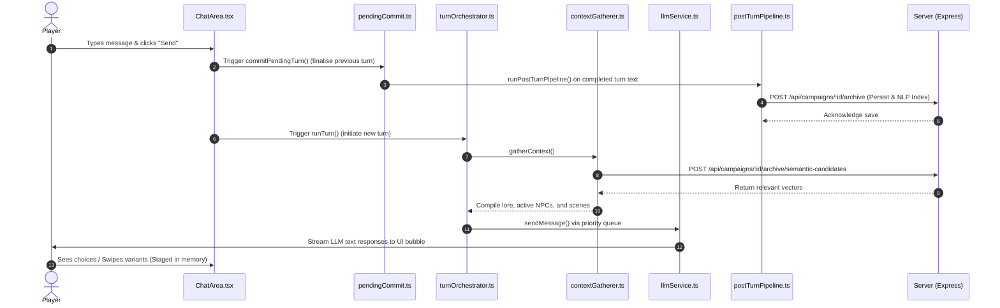

# GM Cockpit (Narrative Engine) — AI System Map & Codebase Guide

This document is a dedicated reference map for AI agents and human developers. It defines the logical boundaries, code responsibilities, execution flows, and **blast radius assessment** for the `mainApp` repository.

---

## 1. System Architecture & Tech Stack Overview
Narrative Engine is a self-hosted TTRPG manager designed for lossless session history recall, semantic memory retrieval, and dynamic NPC agency.

```
       [ CLIENT / FRONTEND ]                        [ SERVER / BACKEND ]
+----------------------------------+       +------------------------------------+
|            React 19              |       |             Express.js             |
|   (UI Components & Game Loop)    |       |   (API Routing & Vector Search)    |
+-----------------+----------------+       +-----------------+------------------+
                  |                                          |
        Zustand App Store                                 SQLite3
   (settings, campaign state, chat)                   (sqlite-vec)
                  |                                          |
                  v                                          v
      [ src/services/turn/ ]                       [ server/lib/nlp.js ]
      - turnOrchestrator.ts                        - Name detection
      - pendingCommit.ts                           - Keyword extraction
                  |                                          |
                  +--- HTTP (apiClient) ---------------------+
```

*   **Frontend**: React 19 + TypeScript + Vite. Styled with Tailwind CSS. State is centralized in a 4-slice **Zustand** store.
*   **Backend**: Express.js (ESM). Data is saved as JSON files in `data/` and indexed inside an SQLite database (`data/embeddings.db`) powered by `sqlite-vec` for high-performance local vector similarity search.
*   **Embeddings**: Generated server-side using `@huggingface/transformers` running a local ONNX model in a worker thread.
*   **LLM Connection**: The client contacts Ollama or OpenAI endpoints directly via a prioritised concurrency-controlled request queue.

---

## 2. Subsystem Feature Map (Logical to Code)

The table below maps game systems to their respective code modules, exports, and core responsibilities.

| Subsystem | Core File | Key Exports | Role & Responsibility |
| :--- | :--- | :--- | :--- |
| **Turn Orchestration** | [`src/services/turn/turnOrchestrator.ts`](file:///d:/Games/AI%20DM%20Project/Automated_system/mainApp/src/services/turn/turnOrchestrator.ts) | `runTurn()` | **Main Game Loop**: Resolves pre-rolled/manual dice, calls context gathering, invokes LLM requests, streams content to React UI, and stages tool callbacks. |
| **Turn Finalization** | [`src/services/turn/pendingCommit.ts`](file:///d:/Games/AI%20DM%20Project/Automated_system/mainApp/src/services/turn/pendingCommit.ts) | `commitPendingTurn()`, `capturePendingTurnSnapshot()` | **Commit Pipeline**: Caches temporary swipes, and upon committing, runs the post-turn NLP pipelines, stores facts, and executes token auto-condensation. |
| **Context Gathering** | [`src/services/turn/contextGatherer.ts`](file:///d:/Games/AI%20DM%20Project/Automated_system/mainApp/src/services/turn/contextGatherer.ts) | `gatherContext()` | Orchestrates context retrieval: pulls relevant lore chunks, active NPCs, and past scenes to build the LLM's system and user context. |
| **Context Refinement** | [`src/services/turn/contextRecommender.ts`](file:///d:/Games/AI%20DM%20Project/Automated_system/mainApp/src/services/turn/contextRecommender.ts) | `contextRecommender` | An LLM-based service that reviews context relevance and selects/prunes items to optimize the token budget. |
| **Payload Assembly** | [`src/services/payload/payloadBuilder.ts`](file:///d:/Games/AI%20DM%20Project/Automated_system/mainApp/src/services/payload/payloadBuilder.ts) | `buildPayload()` | Builds the final system + history + current turn message payload conforming to the LLM's chat schemas. |
| **Post-Turn Pipeline** | [`src/services/turn/postTurnPipeline.ts`](file:///d:/Games/AI%20DM%20Project/Automated_system/mainApp/src/services/turn/postTurnPipeline.ts) | `runPostTurnPipeline()` | Runs after text confirmation: scores scene importance, calls NPC detectors, extracts inventory state shifts, and logs timeline events. |
| **LLM Interface** | [`src/services/llm/llmService.ts`](file:///d:/Games/AI%20DM%20Project/Automated_system/mainApp/src/services/llm/llmService.ts) | `sendMessage()` | Routes API calls to user-configured endpoints (Ollama, OpenAI, Custom API). |
| **Request Queuing** | [`src/services/llm/llmRequestQueue.ts`](file:///d:/Games/AI%20DM%20Project/Automated_system/mainApp/src/services/llm/llmRequestQueue.ts) | `llmRequestQueue` | A priority queue (critical vs. background) ensuring tool calls and main responses do not clash or exceed concurrency parameters. |
| **Vector Indexing** | [`server/lib/vectorStore.js`](file:///d:/Games/AI%20DM%20Project/Automated_system/mainApp/server/lib/vectorStore.js) | `storeArchiveEmbedding()`, `vectorSearch()` | Direct integration with SQLite and `sqlite-vec` containing MMR (Maximal Marginal Relevance) diversity re-ranking algorithms. |
| **Text Analysis** | [`server/lib/nlp.js`](file:///d:/Games/AI%20DM%20Project/Automated_system/mainApp/server/lib/nlp.js) | `extractIndexKeywords()`, `extractNPCNames()` | Server-side parser using fast heuristic regex matches and title lists to detect proper nouns, speech verbs, and NPC references. |
| **Secrets KeyVault** | [`server/vault.js`](file:///d:/Games/AI%20DM%20Project/Automated_system/mainApp/server/vault.js) | `KeyVault` | Class managing local workspace settings encryption via AES-256-GCM. |

---

## 3. Data Flow: Sequence of a Single Turn

Below is the execution flow when a player submits a message:



---

## 4. Blast Radius & Impact Matrix

When making modifications to specific parts of the codebase, consult this matrix to trace downstream effects and avoid architectural regression.

```
+---------------------------------------------------------------------------------------------------+
| MODIFIED FILE / COMPONENT         | DIRECTLY AFFECTED FILES            | DOWNSTREAM IMPACTS       |
+===================================+====================================+==========================+
| server/lib/vectorStore.js         | - server/routes/campaigns.js       | - Semantic recall fails  |
| (Database & vector schema changes) | - server/routes/archive.js         | - MMR rankings fail      |
|                                   | - server/lib/embedder.js           | - Campaign loads lock up |
+-----------------------------------+------------------------------------+--------------------------+
| server/vault.js                   | - server/routes/vault.js           | - Settings unlock fails  |
| (AES key extraction changes)      | - server/routes/settings.js        | - API Keys lost          |
|                                   | - src/store/slices/settingsSlice.ts| - Startup routing breaks |
+-----------------------------------+------------------------------------+--------------------------+
| src/store/slices/campaignSlice.ts | - src/store/useAppStore.ts         | - UI render loop breaks  |
| (Zustand campaign state updates)  | - src/components/ContextDrawer.tsx | - Campaign hydration     |
|                                   | - src/components/ChatArea.tsx      |   issues on reload       |
+-----------------------------------+------------------------------------+--------------------------+
| src/services/llm/llmRequestQueue  | - src/services/llm/llmService.ts   | - Network deadlocks      |
| (Concurrency and priority change) | - src/services/turn/postTurnPipeline| - Tool calls queue      |
|                                   | - src/components/ChatArea.tsx      |   indefinitely           |
+-----------------------------------+------------------------------------+--------------------------+
| src/services/turn/pendingCommit   | - src/components/ChatArea.tsx      | - Message swiping breaks |
| (Swipe lifecycle / Commit events) | - src/services/turn/postTurnPipeline| - NLP updates are skipped|
|                                   | - src/store/slices/chatSlice.ts    | - Duplicated memory logs |
+-----------------------------------+------------------------------------+--------------------------+
| server/lib/nlp.js                 | - server/routes/archive.js         | - Timeline events missing|
| (Entity parser & keywords logic)  | - server/routes/facts.js           | - Missing/broken NPC tags|
|                                   | - src/services/npc/npcDetector.ts  | - Fact ledger bloat      |
+---------------------------------------------------------------------------------------------------+
```

### Critical Risk Zones (High Blast Radius)
1.  **Zustand App Store (`src/store/useAppStore.ts` & slices)**: Everything in the frontend reads from this store. Altering action returns or state keys requires sweeping all references in React components (e.g. `ContextDrawer`, `ChatArea`, `NPCLedgerModal`).
2.  **Turn Commitment (`src/services/turn/pendingCommit.ts`)**: Manages the delicate state between swiping alternative AI messages and committing them. Changes here can result in ghost messages, memory-desyncs, or silent failures where turns are not sent to the server.
3.  **Local Vectors & Database (`server/lib/vectorStore.js`)**: Modifying SQLite query patterns or upgrading the schema without a migrations path will break the local database file `data/embeddings.db` and prevent campaigns from loading.

---

## 5. Dependency Exploration & Impact Analysis Tools

To maintain architecture rules and visualize the codebase, use the following tools:

### Using Graphify (Built-in Script)
This codebase includes a custom parsing script to build interactive visual dependency graphs:
1.  Run the graph compilation:
    ```bash
    node scripts/patch-graph-imports.mjs
    ```
2.  Open [`graphify-out/graph.html`](file:///d:/Games/AI%20DM%20Project/Automated_system/graphify-out/graph.html) in your browser. This will load a interactive community-colored network visualization of the imports and file structure of Narrative Engine.
3.  Review [`graphify-out/import-map.json`](file:///d:/Games/AI%20DM%20Project/Automated_system/graphify-out/import-map.json) for raw dependency mapping data.

### Recommended GitHub Tools & Extensions

For advanced developers and AI agents requiring more power than the static report:

1.  **[CodeLayers](https://marketplace.visualstudio.com/items?itemName=CodeLayers.codelayers) (VS Code Extension)**
    *   *Purpose*: The ultimate "blast radius" assistant.
    *   *How it works*: Renders color-coded indicators directly in your IDE sidebar, highlighting files impacted by edits. "Hops" are colored according to how close they are to the edited file (Red = Direct, Yellow/Green = Downstream).
2.  **[dependency-cruiser](https://github.com/sverweij/dependency-cruiser) (CLI Tool)**
    *   *Purpose*: The gold standard for JS/TS dependency checking.
    *   *How it works*: Inspects your project for circular dependencies or architectural violations (e.g., frontend directly importing backend code). Can render graphs dynamically as Mermaid code.
3.  **[skott](https://github.com/antoine-coulon/skott) (CLI / Web App)**
    *   *Purpose*: Super-fast local dependency graphs.
    *   *How it works*: Generates an interactive visual graph in your browser with circular dependency detection and dead code analysis.
