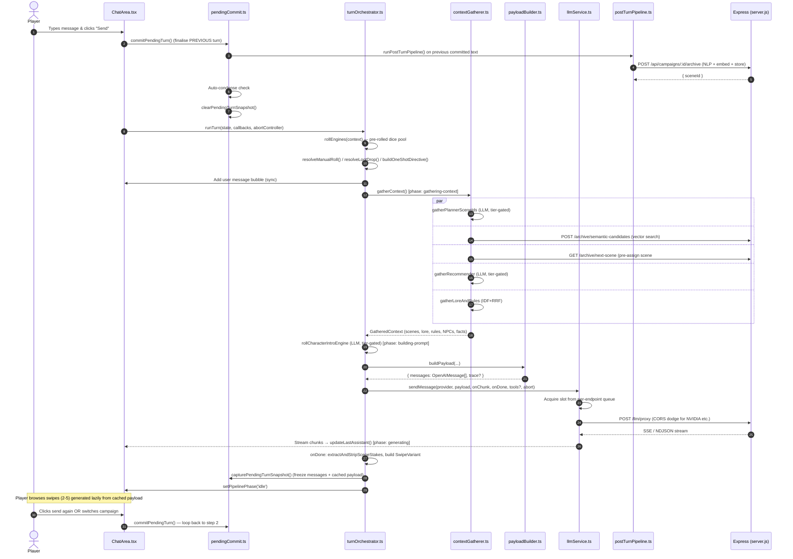

# Narrative Engine (mainApp) — AI System Map & Codebase Guide

> **Comprehensive verified audit** of the Narrative Engine Desktop codebase.
> Every claim below is backed by reading the actual source file. This is the
> authoritative reference for AI agents and human developers touching this repo.
> For exhaustive feature listings see [`FEATURE_INVENTORY.md`](./FEATURE_INVENTORY.md).
> For architectural innovations see [`INNOVATIONS.md`](./INNOVATIONS.md).
> For the full directory layout see [`ARCHITECTURE.md`](./ARCHITECTURE.md).

---

## 1. System Architecture & Tech Stack

Narrative Engine is a self-hosted TTRPG manager designed for lossless session
history recall, semantic memory retrieval, dynamic NPC agency, and engine-driven
anti-sycophancy. It runs as a desktop app (Electron wrapping a Vite React
frontend + Express backend) or as a standalone web app (Vite dev server + Express).

```
   [ CLIENT / FRONTEND ]                            [ SERVER / BACKEND ]
+-----------------------------+              +------------------------------+
| React 19 + TypeScript + Vite |              |       Express 5 (ESM)        |
| Zustand (6 slices)          |              |  CORS allowlist (Electron +  |
| Tailwind CSS 4              |              |  Vite only), localhost-only   |
| PixiJS 8 (overworld map)    |              |  127.0.0.1:3001 bind          |
+--------------+--------------+              +--------------+---------------+
               |                                            |
     HTTP /api (Vite proxy in dev,                         |
     absolute http://localhost:3001 in Electron)           |
               +-----------------------+--------------------+
                                       |
                +----------------------v----------------------+
                |                server.js                    |
                | KeyVault auto-init → ensureDirs → initDb →  |
                | warmupEmbedder → warmupTts → mount 16       |
                | routers → listen 127.0.0.1:3001             |
                +-------+-----------------+-------------------+
                        |                 |
              +---------v------+   +-------v----------+
              | better-sqlite3 |   | File I/O         |
              | + sqlite-vec    |   | data/campaigns/  |
              | (archive_vss,  |   | <id>.archive.md  |
              |  lore_vss,     |   | <id>.archive.    |
              |  rules_vss)    |   |   index.json     |
              | cosine distance|   | <id>.archive.    |
                +---------+------+   |   chapters.json  |
                          |          | <id>.timeline.json
                  +-------v------+    | <id>.entities.json
                  | embedder.js  |    | <id>.facts.json
                  | mxbai-embed-  |    | <id>.lore.json
                  | large-v1 q8   |    | <id>.npcs.json
                  | 1024 dims    |    | <id>.overworld.json
                  | LRU 512      |    | <id>.divergence.json
                  +--------------+    +------------------+
```

| Layer | Technology |
|-------|-----------|
| Frontend | React 19.2 + TypeScript 5.9 (strict) + Vite 8 + Tailwind 4 |
| State | Zustand 5 (6 slices: settings, campaign, chat, ui, map, worldLore) |
| Backend | Express 5 (ESM), Node ≥ 20.19, localhost-only bind |
| Database | JSON files per campaign in `data/campaigns/<id>/` |
| Vector search | better-sqlite3 + sqlite-vec (cosine distance, 3 vec0 tables) |
| Embedding | `@huggingface/transformers` local ONNX `mixedbread-ai/mxbai-embed-large-v1` q8, 1024 dims |
| Token counting | js-tiktoken |
| TTS | `kokoro-js` Kokoro-82M q8 (lazy warmup, SHA-256 WAV cache) |
| LLM streaming | Direct fetch to Ollama / OpenAI / Claude / Gemini via per-endpoint priority queue |
| LLM proxy | Server-side `/llm/proxy` route forwards provider calls to dodge browser CORS |
| Encryption | Node `crypto` AES-256-GCM + PBKDF2-SHA256 600k iterations (password) or 10k (machine key) |
| Desktop | Electron (nodeIntegration:false, contextIsolation:true) |
| Testing | Vitest 4 + React Testing Library + Supertest (84 test files, ~1,055 tests) |
| Shared core | `@narrative/engine` (file-linked `packages/engine`, platform-pure, no DOM/Node libs) |

---

## 2. Subsystem Feature Map (Logical → Code)

The codebase is organized into 14 subsystems. Each subsystem has its own
directory under `src/services/` (or `server/`) with co-located `__tests__/`.

| Subsystem | Primary Directory | Key Files | Role |
|---|---|---|---|
| **Turn Orchestration** | `src/services/turn/` | `turnOrchestrator.ts`, `turnStages.ts`, `turnContext.ts`, `pendingCommit.ts`, `contextGatherer.ts`, `contextRecommender.ts`, `postTurnPipeline.ts`, `aiTier.ts`, `toolHandlers.ts`, `toolRegistry.ts`, `contextMinifier.ts`, `sceneContinue.ts`, `sceneStakesTag.ts`, `swipeGeneration.ts`, `tagGeneration.ts`, `gatherProgress.ts`, `sceneStakesTelemetry.ts`, `directorBrief.ts`, `directorWatchdog.ts` | Main game loop, turn stages, thread-safe data context bus, swipe lifecycle, post-turn NLP, director brief, NPC watchdog |
| **NPC Agency** | `src/services/npc/agency/` | `agencyEngine.ts`, `agencyBands.ts`, `agencyPools.ts`, `agencyConstants.ts`, `agencyDice.ts`, `agencyDrift.ts`, `agencyGoals.ts`, `agencyHeartbeat.ts`, `agencyLifecycle.ts`, `agencyProgress.ts`, `agencySelection.ts`, `agencyTimeskip.ts`, `agencyTimeskipRun.ts`, `agencyCollision.ts`, `agencyDigest.ts`, `agencyAudition.ts`, `agencyWantDraw.ts` | Heartbeat-driven off-screen NPC life, goal rolls, hex drift, tier-cross, collision tangling, timeskip |
| **NPC Generation & Behavior** | `src/services/npc/` (+ `npc-generation/`) | `npcDetector.ts`, `npcBehaviorDirective.ts`, `npcPressureTracker.ts`, `reactionMenu.ts`, `reactionRepression.ts`, `relationMeter.ts`, `hexRoll.ts`, `manualAdd.ts`, `npcManualResolve.ts`, `npcReview.ts`, `portraitPrompt.ts`, `signatureKit.ts`, `troublemaker.ts`, `dispositionGroups.ts`, `hexVoiceGuide.ts` + `npc-generation/` (profile, charIntroEngine, etc.) | Name detection (7-pass), hex roll inside envelope, reaction menu, repression layer, relation meter, drift alerts, knowledge boundary |
| **Prompt Assembly** | `src/services/payload/` | `payloadBuilder.ts`, `stable.ts`, `volatile.ts`, `world.ts`, `history.ts`, `budgets.ts`, `pinnedMemories.ts`, `traceCollector.ts` | 5-block payload assembly with Anthropic prompt-cache annotations |
| **Archive Memory** | `src/services/archive-memory/` | `recall.ts`, `idf.ts`, `scoring.ts`, `dynamicMax.ts`, `condenser.ts`, `deepArchiveSearch.ts`, `archiveChapterEngine.ts`, `archiveManager.ts`, `archivePlanner.ts`, `backfillRunner.ts`, `importanceRater.ts`, `sceneEventExtractor.ts`, `witnessCapture.ts` | RRF hybrid retrieval, IDF, dynamic ceiling, deep search, chapter funnel, witness capture |
| **Rules RAG** | `src/services/rules/` | `defaultRules.ts`, `rulesIndexer.ts`, `rulesRetriever.ts` | System rules text, RAG rules chunking + IDF+RRF retrieval |
| **Lore RAG** | `src/services/lore/` | `loreChunker.ts`, `loreRetriever.ts`, `loreNPCParser.ts`, `loreEngineSeeder.ts`, `loreCheck.ts`, `loreKeywordEnricher.ts`, `lootTreeLoader.ts`, `worldLoreAI.ts`, `worldLoreExport.ts`, `worldLoreImport.ts` | Lore chunking with RAG hints, IDF+RRF retrieval, lore-consistency verifier, world-builder AI |
| **Campaign State** | `src/services/campaign-state/` | `divergenceRegister.ts`, `knowledgeScope.ts`, `timelineResolver.ts` | Divergence register (Phase 6), scoped knowledge tokens, timeline supersession |
| **LLM Interface** | `src/services/llm/` | `llmService.ts`, `llmRequestQueue.ts`, `apiClient.ts`, `llmFetch.ts`, `cacheTelemetry.ts`, `timeouts.ts`, `utilityCallTracker.ts` + `utils/llmCall.ts`, `utils/llmApiHelper.ts` | Streaming chat, per-endpoint adaptive concurrency queue, utility call tracker, cache telemetry |
| **Engines** | `src/services/engine/` | `engineRolls.ts`, `diceTier.ts`, `lootEngine.ts`, `pcCreationScript.ts` | Pre-rolled dice, fairness DC, 3-gate manual rolls, loot tree walker, PC point-buy |
| **Arc Engine** | `src/services/arc/` | `arcEngine.ts` (+ types in `src/types/arc.ts`) | 7-type systemic conflict engine with stage ladder, stance tracking, tick DC |
| **One-Shot Events** | `src/services/oneshot/` | `oneShotEvents.ts` | Manual event injector |
| **OOC / Ask GM** | `src/services/ooc/` | `askGmHandoff.ts`, `oocService.ts`, `context.ts`, `retrieval.ts` | Out-of-character side chat with the utility AI; arming brief for next turn |
| **Map Engine** | `src/services/mapEngine/` | `worldOrchestrator.ts` (+ components/map/ PixiJS renderer) | LLM-driven overworld generation, biome zones, anchors, pins |
| **Infrastructure** | `src/services/infrastructure/` | `backgroundQueue.ts`, `jsonExtract.ts`, `tokenizer.ts`, `settingsCrypto.ts` | Background task queue, robust JSON extraction, AES-GCM settings crypto |
| **Server Backend** | `server/` | `server.js`, `vault.js`, `lib/` (10 files), `routes/` (16 files), `services/` (7 files) | Express app, KeyVault, vector store, embedder, NLP, routes, archive service |
| **State Store** | `src/store/` | `useAppStore.ts`, `campaignStore.ts`, `campaignHydrator.ts`, `slices/` (7 slice files) | Zustand composition root + 6 slices + hydration orchestrator |
| **UI Components** | `src/components/` | 16 subdirectories (`chat/`, `context-drawer/`, `npc-ledger/`, `location-ledger/`, `settings-modal/`, `message/`, `pc/`, `ooc/`, `tts/`, `inventory/`, `map/`, `primitives/`, `hooks/`, `npc-ledger/`, `world-lore/`, `pinned-memories/`) | All React components, hooks, modals |
| **Shared Engine** | `packages/engine/` | `src/{json,loot,retrieval,rolls}/` | Platform-pure shared core (no DOM/Node) consumed by both mainApp and mobileApp |

---

## 3. Data Flow: Sequence of a Single Turn



---

## 4. Blast Radius & Impact Matrix

When modifying core files, consult this matrix to trace downstream effects.

```
+-------------------------------------------------------------------------------------------------------+
| MODIFIED FILE / COMPONENT                  | DIRECTLY AFFECTED                | DOWNSTREAM IMPACTS        |
+============================================+==================================+==========================+
| server/lib/vectorStore.js                  | - server/services/vectorService | - Semantic recall fails   |
| (sqlite-vec schema, MMR, dims)             | - server/services/archiveService| - MMR rankings break      |
|                                            | - server/routes/archive.js      | - Campaign loads lock up  |
|                                            | - src/services/llm/apiClient    | - Reindex required        |
+--------------------------------------------+----------------------------------+----------------------------+
| server/vault.js                            | - server/routes/vault.js        | - Settings unlock fails   |
| (AES-256-GCM, PBKDF2, binary format)       | - server/routes/settings.js     | - API keys lost           |
|                                            | - src/store/slices/settingsSlice| - Startup routing breaks  |
|                                            | - src/services/infrastructure/  | - .nevault import/export  |
|                                            |   settingsCrypto.ts             |   fails                   |
+--------------------------------------------+----------------------------------+----------------------------+
| src/store/slices/campaignSlice.ts          | - src/store/useAppStore.ts      | - UI render loop breaks   |
| (Zustand campaign state)                   | - src/components/ContextDrawer | - Campaign hydration      |
|                                            | - src/components/ChatArea.tsx   |   fails on reload         |
|                                            | - src/store/slices/chatSlice.ts | - debouncedSaveCampaign   |
|                                            |   (imports debouncedSave fn)    |   State signature changes |
+--------------------------------------------+----------------------------------+----------------------------+
| src/services/llm/llmRequestQueue.ts        | - src/services/llm/llmService.ts| - Network deadlocks       |
| (per-endpoint adaptive concurrency)        | - src/utils/llmCall.ts          | - Tool calls queue        |
|                                            | - src/services/turn/postTurnPipe|   indefinitely            |
|                                            | - src/components/ChatArea.tsx   | - Rate-limit recovery     |
|                                            |                                  |   misfires                |
+--------------------------------------------+----------------------------------+----------------------------+
| src/services/turn/pendingCommit.ts          | - src/components/ChatArea.tsx   | - Message swiping breaks  |
| (swipe lifecycle / commit events)          | - src/services/turn/postTurnPipe| - NLP updates skipped     |
|                                            | - src/store/slices/chatSlice.ts| - Duplicated memory logs  |
|                                            | - src/App.tsx (reconcileOnLaunch)| - Ghost messages on crash |
+--------------------------------------------+----------------------------------+----------------------------+
| server/lib/nlp.js                          | - server/services/archiveService| - Timeline events missing |
| (entity parser, keywords, witness)        | - server/services/nlpPipeline.js| - Missing/broken NPC tags |
|                                            | - server/routes/archive.js      | - Fact ledger bloat       |
|                                            | - src/services/npc/npcDetector.ts| - Witness data wrong      |
+--------------------------------------------+----------------------------------+----------------------------+
| src/services/payload/payloadBuilder.ts    | - src/services/turn/turnOrchestr| - LLM payload malformed  |
| (5-block assembly + cache control)         | - src/services/turn/sceneContinue| - Cache busts every turn  |
|                                            | - src/services/turn/swipeGenerat| - Token budget overflow   |
|                                            | - src/components/TokenGauge.tsx  | - Wrong system prompt     |
+--------------------------------------------+----------------------------------+----------------------------+
| src/services/archive-memory/recall.ts     | - src/services/turn/contextGath | - Recall returns nothing  |
| (RRF fusion, divergence surfacing)         | - src/services/payload/world.ts | - Wrong scenes injected   |
|                                            | - src/services/archive-memory/   | - Divergence continuity   |
|                                            |   archiveChapterEngine.ts       |   breaks                  |
+--------------------------------------------+----------------------------------+----------------------------+
| src/services/npc/agency/agencyEngine.ts   | - src/services/turn/postTurnPipe| - NPC agency ticks dead   |
| (heartbeat, audition, goal roll)           | - src/services/payload/world.ts | - Timeskip narration dead |
|                                            | - src/store/slices/campaignSlice| - Hex drift stops         |
+--------------------------------------------+----------------------------------+----------------------------+
| src/services/rules/defaultRules.ts         | - src/services/payload/stable.ts| - GM loses autonomy rules |
| (system rules text)                        | - src/services/rules/rulesIndexer| - Dialogue format regresses|
|                                            | - src/services/lore/loreChunker | - RAG chunks re-derived   |
+--------------------------------------------+----------------------------------+----------------------------+
| src/types/index.ts + sibling type files    | - All src/ files importing types | - Compile errors          |
| (GameContext, NPCEntry, ChatMessage, etc.)| - packages/engine/src/*         | - Migration logic lost    |
|                                            |                                  | - Defaults change         |
+-------------------------------------------------------------------------------------------------------+
```

### Critical Risk Zones (High Blast Radius)

1. **`server/lib/vectorStore.js`** — sqlite-vec schema, MMR algorithm, embedding versioning. A schema change without a migration path breaks `data/embeddings.db` and prevents campaigns from loading. The `EMBEDDING_VERSION = 1` constant + `embedding_meta` table are the migration seam.
2. **`server/vault.js`** — custom binary format with magic bytes `NEV1`. Any change to the IV/ciphertext/tag layout breaks every existing `.nevault` file. PBKDF2 iteration count changes also re-derive keys.
3. **`src/store/slices/campaignSlice.ts`** — exports `debouncedSaveCampaignState` consumed by chatSlice; exports `defaultContext` consumed by `services/campaignInit`; registers the live-state getter used by all debounced saves. Renaming or removing any export breaks the save pipeline.
4. **`src/services/turn/pendingCommit.ts`** — owns the in-memory `PendingTurnSnapshot` singleton. The snapshot invariant (importance rater must NEVER see next-turn messages) is load-bearing. Launch reconciliation handles Electron/renderer death mid-browse.
5. **`src/services/payload/payloadBuilder.ts`** — Anthropic prompt-cache `cache_control: ephemeral` placement is exactly tuned. Moving stable/divergence/pinned blocks out of the cached prefix or moving volatile/RAG-rules/user-message into the cache busts every cached turn.
6. **`src/types/gamecontext.ts`** — contains `migrateLegacyContext()` which is called every campaign hydration. Changing the migration logic without bumping the divergence register version silently corrupts old campaigns.

---

## 5. Test Discipline

| Stat | Value |
|---|---|
| Test files | 84 (73 in `src/`, 7 in `server/__tests__/`, 4 in `packages/engine/`) |
| Estimated `it/test` blocks | ~1,055 |
| Naming convention | `*.test.ts(x)` (no `.spec.ts` anywhere) |
| Co-location | `__tests__/` subdirectory next to source |
| Test runner | Vitest 4 with jsdom + React Testing Library |
| Server tests | Use `fs.mkdtempSync(os.tmpdir())` + `process.env.DATA_DIR` override for isolation |
| Coverage | Opt-in via `--coverage` flag; no thresholds set |
| Setup file | `src/test/setup.ts` (jest-dom matchers + scrollIntoView/scrollHeight polyfills) |
| Boundary gate | `packages/engine/scripts/boundary-gate.mjs` runs as `pretest` to enforce engine purity |

Largest test files: `server/__tests__/nlp.test.js` (68 tests), `src/services/lore/__tests__/loreChunker.test.ts` (53 tests), `src/services/__tests__/payloadBuilder.test.ts` (1,252 lines / 55 tests).

---

## 6. Key Files for Quick Reference

| "How does X work?" | Read this file |
|---|---|
| "How does a turn work?" | `src/services/turn/turnOrchestrator.ts` (509 lines) |
| "How is a swipe committed?" | `src/services/turn/pendingCommit.ts` (298 lines) |
| "How is context built?" | `src/services/turn/contextGatherer.ts` + `src/services/payload/payloadBuilder.ts` |
| "How is the payload structured?" | `src/services/payload/{payloadBuilder,stable,volatile,world,history,budgets}.ts` |
| "How are scenes archived?" | `server/routes/archive.js` + `server/services/archiveService.js` (826 lines) |
| "How does vector search work?" | `server/lib/vectorStore.js` (325 lines, MMR + cosine + embedding versioning) |
| "How does embedding work?" | `server/lib/embedder.js` (mxbai-embed-large-v1 q8, 1024 dims, LRU 512) |
| "How does RRF fusion work?" | `src/services/archive-memory/recall.ts` + `packages/engine/src/retrieval/lexicalFusion.ts` |
| "How does IDF work?" | `src/services/archive-memory/idf.ts` (signature-gated cache) |
| "How does NPC agency tick?" | `src/services/npc/agency/agencyEngine.ts` (386 lines) |
| "How do reaction menus work?" | `src/services/npc/reactionMenu.ts` + `reactionRepression.ts` |
| "How does the repression layer work?" | `src/services/npc/reactionRepression.ts` (concealed vs leaked, BURST_THRESHOLD=4) |
| "How does the relation meter work?" | `src/services/npc/relationMeter.ts` (asymmetric rise/fall thresholds) |
| "How does the hex roll work?" | `src/services/npc/hexRoll.ts` (weighted-never-walled Gaussian) |
| "How are scenes summarized?" | `src/services/saveFileEngine.ts` (`sealChapterCombined`) |
| "How do chapters auto-seal?" | `src/services/archive-memory/archiveChapterEngine.ts` (`shouldAutoSeal`) |
| "How does deep search work?" | `src/services/archive-memory/deepArchiveSearch.ts` (2-round LLM funnel) |
| "How does the Arc Engine work?" | `src/services/arc/arcEngine.ts` + `src/types/arc.ts` |
| "How does TTS work?" | `server/lib/tts.js` (Kokoro-82M q8) + `src/components/tts/TtsPlaybackPanel.tsx` |
| "How does the vault work?" | `server/vault.js` (378 lines, AES-256-GCM, PBKDF2) |
| "What are the system rules?" | `src/services/rules/defaultRules.ts` (241-line template literal) |
| "What data does the store hold?" | `src/store/slices/` (7 slice files, see `useAppStore.ts`) |
| "How are NPCs detected?" | `src/services/npc/npcDetector.ts` (7-pass + LLM fail-closed validator) |
| "How does the priority queue work?" | `src/services/llm/llmRequestQueue.ts` (per-endpoint adaptive concurrency) |
| "How are utility calls tracked?" | `src/services/llm/utilityCallTracker.ts` (chained deadline promise + UI strip) |
| "How is the world map generated?" | `src/services/mapEngine/worldOrchestrator.ts` + `src/components/map/OverworldCanvas.tsx` (PixiJS 8) |
| "How is the divergence register rendered?" | `src/services/campaign-state/divergenceRegister.ts` (Phase 6 public/scoped split) |
| "How does knowledge scoping work?" | `src/services/campaign-state/knowledgeScope.ts` (`isKnownToAnyOnStage`, `parseKnownByToken`) |
| "How is the PC created?" | `src/components/pc/PCCreationWizard.tsx` (574 lines, 3-step + point-buy) |
| "How is settings state encrypted?" | `src/services/infrastructure/settingsCrypto.ts` (AES-256-GCM, providers-only at rest) |
| "How is JSON extracted from LLM output?" | `src/services/infrastructure/jsonExtract.ts` (`extractJson`, `extractJsonRobust`) |
| "What are the engine packages?" | `packages/engine/src/{json,loot,retrieval,rolls}/` (platform-pure shared core) |

---

## 7. Dependency Exploration & Impact Analysis Tools

### Graphify (Built-in Script)
This codebase includes a custom parsing script to build interactive visual dependency graphs:
1. Run: `node scripts/patch-graph-imports.mjs`
2. Open `graphify-out/graph.html` in a browser for an interactive community-colored network visualization
3. Review `graphify-out/import-map.json` for raw dependency mapping data

### Recommended External Tools
1. **CodeLayers** (VS Code Extension) — color-coded blast-radius indicators in the IDE sidebar
2. **dependency-cruiser** (CLI) — circular dependency detection + Mermaid graph rendering
3. **skott** (CLI / Web App) — fast local interactive dependency graphs with dead code analysis

---

## 8. Coding Standards & Architecture (Authoritative)

- **Language**: TypeScript (strict mode, `verbatimModuleSyntax`, `erasableSyntaxOnly`, `noUnusedLocals/Parameters`, `noFallthroughCasesInSwitch`) for frontend; Node.js ES Modules (ESM) for backend.
- **State Management**: Central Zustand store (`src/store/useAppStore.ts`) combining 6 slices: `settingsSlice`, `campaignSlice`, `chatSlice`, `uiSlice`, `mapSlice`, `worldLoreSlice`. Avoid ad-hoc state managers. The `create<AppState>()((...a) => ({ ...createXSlice(...a) }))` pattern shares `set`/`get` across slices.
- **Persistence**: NO `persist` middleware. Persistence is manual:
  - Settings → IndexedDB (`idb-keyval`, key `nn_settings`, providers encrypted at rest) + server `PUT /settings` (500ms debounce)
  - Campaign/Chat → server-only via `debouncedSaveCampaignState` (1s debounce) and per-ledger debounced saves
  - UI → ephemeral (no persistence)
  - Map → server `/api/campaigns/:id/overworld` (note: hardcoded `/api` prefix)
  - WorldLore → localStorage (`nn_world_lore_drafts`, the ONLY slice using localStorage)
- **Turn Orchestration**: The main game loop flows through `src/services/turn/turnOrchestrator.ts` (`runTurn()`). Swiping and swipe-commit lifecycles are staged in `src/services/turn/pendingCommit.ts`. The `PendingTurnSnapshot` singleton freezes messages + cached payload at swipe-1 completion so the importance rater never sees next-turn messages.
- **Database & Storage**: JSON file store per campaign in `data/campaigns/<id>/`, indexed by SQLite vector database (`data/embeddings.db`) using `sqlite-vec` for local semantic recall. Three vec0 virtual tables: `archive_vss`, `lore_vss`, `rules_vss` (all cosine distance). Embedding version tracked in `embedding_meta` table for incremental re-indexing on model swap.
- **Encryption**: Application settings presets and keys are encrypted via AES-256-GCM using `KeyVault` (`server/vault.js`). Custom binary format with magic bytes `NEV1`. PBKDF2-SHA256 with 600,000 iterations for password-derived keys, 10,000 for machine-bound keys. Atomic writes via `*.tmp` + `fs.renameSync`.
- **Cache Discipline**: Anthropic prompt-cache `cache_control: ephemeral` placed on stable/divergence/pinned + last history message. Volatile + RAG rules + user message ride BELOW the cache boundary. Per-section token budgets computed by `computeBudgets()` with a guaranteed 5% NPC floor.
- **Engine Purity**: `packages/engine/` enforces platform purity via `boundary-gate.mjs` (rejects imports of `react`, `react-dom`, `zustand`, `@capacitor*`, `idb-keyval`, `better-sqlite3`, `express`, `node:*`). Run as `pretest` hook.
- **Test Discipline**: `*.test.ts(x)` naming. Co-located `__tests__/` folders. Vitest with jsdom. No coverage thresholds (opt-in via `--coverage`).
- **Type Discipline**: Types are structural twins between app (`src/types/`) and engine (`packages/engine/src/*/types.ts`). The app keeps its own `src/types` as source of truth; the engine declares only the fields it reads. Migration logic lives in `src/types/gamecontext.ts` (`migrateLegacyContext`).
- **No Comments Rule**: Per AGENTS.md / project convention, DO NOT add comments unless explicitly requested.

---

## 9. Subsystem Deep-Dives (Verified)

### 9.1 Turn Orchestration (`src/services/turn/`)

**19 production files + 6 test files.**

The main game loop flows through `runTurn()` in `turnOrchestrator.ts`, which orchestrates the execution using decoupled stages defined in `turnStages.ts` and threads a unified `TurnContext` data bus.

`turnContext.ts` (118 lines) — TurnContext data bus:
- Threads a single mutable context object through the turn pipeline, eliminating positional argument coupling (e.g. `buildPayload` parameters are collapsed into options) and local store reads (saves state reads of `useAppStore.getState()`).
- Holds input, evolving outputs, gathered RAG context, trace collection, and director briefs/watchdog dossiers.

`turnStages.ts` (608 lines) — Decoupled turn loop stages:
1. **resolveEngineRolls**: Pre-rolls dice pools and resolves armed rolls/loot drops/one-shot injectors.
2. **addUserTurnMessage**: Synchronously adds the player's message bubble to the state.
3. **gatherTurnContext**: Gathers parallel context candidates (planner, semantic candidates, recommender, lore, rules) via `gatherContext()`.
4. **runIntroEngineStage**: Runs tier-gated NPC introductions.
5. **runDirectorStage**: Evaluates off-stage NPC signals (`directorWatchdog.ts`) and compiles director prompts/nudges (`directorBrief.ts`).
6. **buildTurnPayload**: Compiles prompt payload blocks via `buildPayload()`.
7. **runGenerationStage**: Handles the streaming LLM calls, recursive tool executions (max 5), retries, and post-generation swipe snapshot staging.

`directorWatchdog.ts` (336 lines) — Off-screen NPC life signals:
- Scans current context and active NPCs, constructing a dossiers of off-screen activities, drifts, and signals.
- Injects subtle warnings/directives into the next turn's payload when NPCs drift or cross conflict boundaries.

`directorBrief.ts` (419 lines) — Director Brief payload injection:
- Dynamically generates synopsis updates, backfills chapter/scene descriptions, and wires LOD (Level of Detail) history logic into prompt payloads for context efficiency.

`pendingCommit.ts` (298 lines) owns the singleton snapshot:
- `capturePendingTurnSnapshot()` freezes `turnState`, `messages`, `cachedPayload`, `displayInput`, `activeCampaignId`, `npcLedger` at swipe-1 completion.
- `commitPendingTurn()` (called on next send / Arc Injector / campaign switch): reads chosen variant, runs `classifySceneStakes` if GM omitted the tag (tier-gated), builds `commitState` with `getMessages` returning the frozen array, runs `runPostTurnPipeline`, runs auto-condense check, clears swipe set, saves state.
- `reconcilePendingCommitOnLaunch()` handles Electron/renderer death mid-browse.
- `rebuildStateFromLiveStore()` crash-recovery path.

`postTurnPipeline.ts` (774 lines, longest in `turn/`) runs 3 parallel tracks via `Promise.allSettled`:
- **Archive track**: `rateImportance` (tier-gated) → `api.archive.append` → stamp `sceneId` on assistant message (WO-F) → refresh index/timeline/chapters in parallel → queue background `Event-Extraction` → `Chapter-AutoSeal` if `openChapter.sceneCount >= CHAPTER_SCENE_SOFT_CAP=25`. Inside bookkeeping block (interval-gated): `Profile-Scan`, `Trait-Scan`, `Inventory-Scan`, `Location-Scan` as separate `backgroundQueue.push` tasks.
- **NPC track**: `extractNPCNames` (7-pass) → `validateNPCCandidates` (tier-gated, fail-closed) → split new vs existing → queue `NPC-Update` (tier-gated + cooldown) and `NPC-Drives-Backfill`.
- **Pressure track**: filter active NPCs → `scanPressure` → `buildPressurePatch` per NPC → auto-archive stale (settings.autoArchiveStaleNPCsTurns) → auto-restore archived mentioned.
- Then sequentially: on-stage NPC tracking (`parsePresentHeader`), location header tracking (`resolveLocationHeader`), agency tick (`bumpOnStageActivity` unconditional + `runAgencyTick` tier-gated), inner repression booking (once-per-turn, pure dice), arc engine tick (tier-gated).

`aiTier.ts` (47 lines) — the canonical feature matrix:
- `TierFeature` union of 22 features.
- `MATRIX`: `lite` (all false), `pro` (planner/deepScan/recommender/npcValidate/npcUpdate/sealChapter/sceneStakesClassify/heartbeatTick/timeskipRun/arcTick/arcSpawn/locationEnrich), `max` (everything on).
- `NPC_UPDATE_COOLDOWN`: `{ lite: Infinity, pro: 5, max: 0 }`.

### 9.2 NPC Agency (`src/services/npc/agency/`)

**17 production files + 9 test files.**

The agency tick is a heartbeat-driven NPC off-screen life simulator. Every tick:
1. **Timeskip detection** (`detectTimeskip`, 13 regex patterns): if non-ambiguous weeks>0 and tier allows `timeskipRun`, run `runTimeskipPath` (batched engine state + 1 narration LLM call) and return.
2. **Heartbeat trickle** (`rollHeartbeat`): d100 vs DC starting at 20, -5 per miss, floored at 0, resets to 20 on fire. Guarantees an agency tick fires every ~5 turns at most.
3. **Proximity roster** (`buildProximityRoster`): filter eligible NPCs by region/faction/relation proximity to PC.
4. **Tick target selection** (`selectTickTarget`): audition system. `DEEP_TIER_CAP=3` keeps the active social circle small. `AUDITION_PROB=0.15` for a background NPC to surface. Cold start → uniform-from-roster.
5. **Goal upgrade** (`upgradeWantsToGoals`): idempotent Phase-2 → Phase-3 migration.
6. **Choose tick** (`chooseTick`): color roll (eccentric/impulsive bonus) → highest-score active+allowed goal → need (all blocked) → idle (only from absence).
7. **Goal roll** (`rollGoal`): d20 + karma (`min(failStreak * 2, 6)`) + extraMods vs `GOAL_BASE_DC=10`. Band from margin: critSuccess (nat 20 or margin≥10) / success / successBut / failBut / fail / critFail (nat 1 or margin<-9).
8. **Collision detection** (WO-08): if another NPC's goal coincides (same region or shared keyword) and `Math.random() < COLLISION_TANGLE_PROB=0.5`, resolve as tangle (ally: cooperate; rival: contest with `COLLISION_OPPORTUNITY_BONUS=3`; neutral: mild contest).
9. **Hex drift** (`applyGoalOutcomeNudge`): critSuccess on bold goal → +1 boldness; sustained failure → -1 composure. Clamped ±1 per event, ±3 band.
10. **Tier-cross** (`applyTierCross`): requires BOTH `progress >= quota` AND `justifiedEventFlag` (set by critSuccess). Grinding alone can NEVER cross. Bumps `skillRung` +1 clamped to `rungCeiling`.
11. **Digest** (`buildDigest`): player view (filters `direct|report`, caps at 3, prose with band verb) + debug view (full). Folded into `context.agencyDigest` for the next GM call.

**Innovations**: pre-rolled dice with karma bonus (anti-deadlock guarantee), weighted-never-walled hex roll, rung-ladder tier-cross (grinding alone can't progress), collision tangle between paired NPCs, timeskip narration is the ONLY LLM cost (everything else is engine-resolved).

### 9.3 NPC Generation & Behavior (`src/services/npc/`)

**15 production files + 6 test files.**

- **`npcDetector.ts`**: 7-pass NPC name extraction. Pass 7 (two-consecutive-capitals) is capped at 5/turn. Blocklist ~200 entries. Title stripping via `src/data/titles.json`. `validateNPCCandidates` is fail-closed (returns `[]` on any LLM error so bad validator output never floods the ledger).
- **`npcBehaviorDirective.ts`**: builds the `PLAY AS: ...` runtime directive. Engine numbers NEVER reach the LLM — only band-words (`Bold → Daring`, `Cold → Wary`). `buildReactionMenuLine` calls `buildReactionMenu` then `applyRepressionToMenu`, emits `REACTIONS (choose ONE and play it — do NOT invent a softer reaction; prefer the less obvious when several fit): <a | b | c>`. `buildDriftAlert` emits `SHIFT:` lines when band WORD changes (sub-band moves aren't surfaced). `buildKnowledgeBoundary` does Layer 1 (scene-witness filter) + Layer 2 (divergence-fact knownBy tokens).
- **`reactionMenu.ts`**: engine-build the reaction menu. Score = Σ `axisWeights[a] * hex[a]` + `relationWeight * pcRel` + `|traitKeys ∩ traits| * TRAIT_BONUS(2)`. Gate: `requireTraitAny`, `forbidTraitAny` (UNCONDITIONAL exclude), `forbidTraitWhenClose` (only when `pcRel >= RELATION_CLOSE=2`). Top 5 candidates, take top[0] + 2 sampled via Fisher-Yates partial shuffle. The sycophant-anti-pattern: story AI is a sycophant that invents the gentlest reaction, so the engine pre-filters and the AI only picks.
- **`reactionRepression.ts`**: NPC inner repression layer. `repressKind`: `concealed` (relationWeight<0, betrayal), `leaked` (warmth+empathy<0, contempt), `none`. `hideScore = (composure - boldness) - pcRelation - pressure`. `BURST_THRESHOLD=4` forces express + discharge all pressure + catharsis roll. Two tells (`leaked`/`concealed`) instead of one — betrayal can't "leak on your face," it leaks in behavior. Repression EVENT (did they hide?) decided by dice, decoupled from what the AI renders.
- **`relationMeter.ts`**: engine-owned hidden sub-band relationship meter. Asymmetric: `RISE_THRESHOLD=100` per band up, `FALL_THRESHOLD=50` per band down. `'bonding'` capped at `COMRADE_BAND_CAP=1` (Friendly). `'betrayal'` uncapped. The AI's ONLY job is to label the tone; the engine owns the actual standing.
- **`hexRoll.ts`**: Phase 1 NPC Generation Refit. `rollWeightedAxis`: Gaussian-weighted bucket distribution centered on `envelope.center` with `sigma` per `spread` (`tight=0.7 / normal=1.4 / wide=2.4`). `MIN_WEIGHT_FLOOR=0.005` guarantees the rare extreme (-3/+3) stays reachable at every spread — the load-bearing "weighted, never walled" rule. The model PROPOSES (groups + 2 anchor traits); the engine ROLLS (variety + refusal to converge); the model RENDERS.
- **`npcPressureTracker.ts`**: per-NPC ignored/engaged pressure. `scanPressure`: mentionsName (+1 engaged), pronounNearName (+0.5), directsActionAt (+2), triggersKeyword (+1 ignored), crossesSoftBoundary (+1 ignored). `shouldArchiveNPC` after 15 turns AND decayed pressure < 0.5 AND affinity < 7 AND no shiftNote.

### 9.4 Prompt Assembly (`src/services/payload/`)

**8 production files + 1 test file.**

`payloadBuilder.ts` (86 lines) — top-level entry point. Final assembly order with Anthropic `cache_control: ephemeral`:
1. Stable system message (cached) — `buildStable`
2. Divergence system message (cached, public-only) — `buildWorld` returns separately
3. Pinned memories system message (cached) — `buildPinnedMemoriesBlock`
4. History messages (cached prefix; last history msg gets cache_control stamp) — `buildHistory`
5. **Final user message** (BELOW cache boundary): joins `retrievedRulesContent + worldContent + volatileContent + GM_REMINDER + askGmBrief + userMessage`

`GM_REMINDER` constant: `'[GM REMINDER: NPCs push back when their wants/boundaries are crossed. Do not default to facilitation.]'` — anti-sycophancy nudge folded into every final user turn.

`stable.ts` (83 lines): rules (raw fallback or RAG-selected, returned separately as `retrievedRulesContent`), canon state, header index, starter, continue prompt, reasoning-model guard (regex `/deepseek-r|qwq|qwen.*think|r1/i`).

`volatile.ts` (210 lines): character stub, inventory, profile (with scene-aware trait retrieval via `queryTraits`), location block (WO-Location, 400-char cap with graceful degradation), scene notebook. `CORE_FLOOR_TRAITS=5` guarantees 5 essential PC traits always injected. Smart bookkeeping stub floor always injected to prevent total amnesia.

`world.ts` (532 lines, largest in `payload/`): archive recall (perceptual filter — only scenes witnessed by active NPCs), recent scene events (last 3, 350-token budget), RAG lore (grouped by category), timeline resolution, active NPCs (tiered WO-G), scoped knowledge block (Phase 6), agency/arc digests, divergence register (public-only, cached). **Two-phase NPC floor budget**: NPC block gets guaranteed 5% floor decoupled from world budget; unused floor flows back. **Planner event type auto-derivation** from recent scene events when no explicit param. **NPC Signature Kit v1**: durable loadout (equipment/abilities/element) rides CORE so scene-tag filtering can never drop it — "anti-drift analogue of personalityHex."

`history.ts` (125 lines): fits conversation into remaining budget (newest-first), strips `[DICE OUTCOMES:|SURPRISE EVENT:|...]` tags, ephemeral tool cleanup (reclaims tokens from stale tool results), orphan protection (drops leading `tool` role messages), depth-injects scene note at configurable depth (default 3).

`budgets.ts` (32 lines): `computeBudgets(limit, rulesBudgetPct, hasDeepContext)`. Rules budget = 10% default. NPC = 5% guaranteed floor (taken OUT of world allocation). With deep context: stable 15%, world 60%-npc, volatile 10%. Without: stable 25%, world 40%-npc, volatile 10%.

### 9.5 Archive Memory (`src/services/archive-memory/`)

**13 production files + 2 test files.**

`recall.ts` (221 lines) — RRF fusion entry point:
1. `extractContextActivations` (user 1.0, recent assistant 0.7, older 0.3, NPC ledger 1.0; 2-char minimum).
2. `expandActivationsWithFacts` (1-hop at 0.5×source weight, 2-hop at 0.25×source weight — semantic query expansion via knowledge graph).
3. `computeArchiveIdf` (signature-gated cache, BM25-style smoothing `log(1 + (N - df + 0.5) / (df + 0.5))`).
4. `applyEventBoost` (importance≥7 = +1.5, character match = +1.0, location match = +1.0).
5. Keyword ranker (`scoreEntry`): `keywordRelevance = 2.0 * activation`. POV multipliers: witness ×1.5, mentioned ×0.8, outsider ×0.3. NPCs weighted 1.5× keywords.
6. Embedding ranker (server-side, scope-filtered).
7. `fuseRRF(keyword, embedding)` (k=60).
8. Divergence force-surfacing (matched keep fused order; unmatched injected after by recency).
9. `computeDynamicMax` (consensus-based ceiling: more agreement → more scenes).

`condenser.ts` (37 lines) — current condenser: `VERBATIM_WINDOW=10`, budget ratios `tight=0.5 / default=0.75 / deep=0.90`. This is the decision logic only; actual summarization lives in `saveFileEngine.ts` (`sealChapterCombined`).

`deepArchiveSearch.ts` (387 lines) — 2-round LLM deep scan: chapter scan → scene drill-down → unscanned chapter discovery → fetch verbatim → summarize to budget (with 8000-token partitioning for large corpora).

`archiveChapterEngine.ts` (379 lines) — chapter auto-seal (threshold 25 OR new SESSION_ID) + iterative funnel retrieval (chapter 3D scoring → LLM validation → scene-level scoring → fetch within 3000-token budget). `MAX_LLM_ITERATIONS=5`, `MAX_CONFIRMED_CHAPTERS=3`.

### 9.6 Server Backend (`server/`)

**45 source/test/script files** under `server/` plus the root `server.js`.

Key library files:
- **`server/lib/vectorStore.js`** (325 lines): sqlite-vec with 3 vec0 tables (cosine distance). `EMBEDDING_VERSION=1` + `embedding_meta` table for incremental re-indexing. `MMR_LAMBDA=0.7`, `MMR_MIN_POOL=4`. Greedy MMR selection seeded with top-1 (top-1 never displaced). Rules deliberately NOT diversified (would evict the one needed rule). Dynamic dims via `resolveDims()` reading `settings.json → settings.embeddingDims`. Schema mismatch → drop and rebuild + warn to run `migrateEmbeddings.js`.
- **`server/lib/embedder.js`** (202 lines): `mixedbread-ai/mxbai-embed-large-v1` q8, 1024 dims, LRU 512. `resolveIndexingSpeed`: eco (`batchSize:4, delayMs:250`), balanced (`8, 100`), aggressive (`16, 0`). `buildArchiveText` / `buildLoreText` feature engineering capped at 500 chars.
- **`server/lib/nlp.js`** (361 lines): 6-pass NPC name detection (Pass 7 deliberately omitted server-side — no LLM validator). `estimateImportance` (1-10, +3 for death words, +2 for MEMORABLE tags). `extractWitnessesHeuristic`. `extractTimelineEventsRegex` (5 predicates with importance scoring).
- **`server/lib/entityResolution.js`** (52 lines): 3-tier normalization (exact → substring → Levenshtein with adaptive threshold 2/3).
- **`server/lib/tts.js`** (205 lines): Kokoro-82M q8, `DEFAULT_VOICE='af_heart'`, SHA-256 WAV cache at `data/.tts_cache/audio/`. kokoro-js v1.2.1 ASAR workaround (sets `HF_HOME`/`TRANSFORMERS_CACHE`/etc. before import). Warmup is no-op if model not cached (no 90MB download on first launch).
- **`server/vault.js`** (378 lines): `MAGIC='NEV1'`, AES-256-GCM, PBKDF2-SHA256 600k iterations (password) / 10k (machine key). Binary format: `[4B magic][4B ct length][12B IV][N B ct][16B GCM tag][optional 16B salt]`. Format auto-detection via length heuristic. Remembered-key tiered security (Electron `safeStorage` preferred, plaintext hex fallback in dev only). Atomic writes via `*.tmp` + `renameSync`.

Key service files:
- **`server/services/archiveService.js`** (826 lines): orchestrator for archive. `appendScene` runs 6 NLP heuristics inline, fire-and-forget embedding, chapter auto-lifecycle. `rollbackScenesFrom` trims archive.md + index + timeline + repairs chapters. `deleteScene` surgical single-scene delete. `updateSceneAssistant` edit-sync with re-embed (awaited). `archiveSemanticCandidates` short-circuits when `!isModelReady() || isJobRunning()` (returns `{pending:true}` so client falls back to lexical). `reindexEmbeddings` 4-pass reindex (stale scenes, stale lore, backfill unversioned scenes, backfill unversioned lore).
- **`server/services/nlpPipeline.js`** (112 lines): deferred LLM extraction. Wired to `archive:written` event. Runs via `setImmediate` after `res.json()`. Each write under `withCampaignLock`. Regex fallback when LLM returns null. Errors logged and swallowed (deferred failures must not crash).
- **`server/services/llmProxy.js`** (193 lines): server-side LLM calls for utility extraction. `TIMELINE_PREDICATES_SERVER` 12-element allowlist. `callLLMWithRetry` with exponential backoff capped at 4s. `extractWitnessesLLM` (5000ms timeout, 1 attempt), `extractTimelineEventsLLM` (6000ms timeout, 2 attempts). `normalizeEndpoint` auto-appends `/v1` to bare hosts.

Routes: 16 routers mounted in `server.js` (vault, settings, campaigns, archive, chapters, timeline, facts, backups, assets, overworld, transfer, divergence, rules, llmProxy, embedding, tts). See `ARCHITECTURE.md` § API Route Table for the full endpoint list.

### 9.7 Zustand Store (`src/store/`)

**14 files (10 source + 4 tests).** 6 slices composed in `useAppStore.ts`:

| Slice | Persistence | Key State |
|---|---|---|
| `settingsSlice` | IndexedDB (`nn_settings`, providers encrypted) + server `PUT /settings` (500ms debounce) | `settings` (44 fields), `vaultStatus`, `vaultLoading` |
| `campaignSlice` | Server-only (4 debounced saves, 1s debounce) | `activeCampaignId`, `loreChunks`, `archiveIndex`, `chapters`, `npcLedger`, `onStageNpcIds`, `npcSuggestions`, `locationLedger`, `locationSuggestions`, `semanticFacts`, `timeline`, `entities`, `pinnedChapterIds`, `context` (~70 fields), `inventoryItems`, `characterProfileData`, `bookkeepingTurnCounter`, `autoBookkeepingInterval` |
| `chatSlice` | Via shared `debouncedSaveCampaignState` | `messages`, `isStreaming`, `condenser`, `divergenceRegister`, `pinnedExcerpts`, `renameModalOpen/Text` |
| `uiSlice` | Ephemeral (no persistence) | 27 toggles: settingsOpen, drawerOpen, npcLedgerOpen, locationLedgerOpen, backupModalOpen, lastPayloadTrace, pipelinePhase, streamingStats, loreCheck*, divergenceEntryOpen, deepArmed, armedRoll, diceRollModalOpen, armedLoot, lootRollModalOpen, armedOneShot, troubleModal*, composerInjection, pinnedMemoriesOpen |
| `mapSlice` | Server `/api/campaigns/:id/overworld` (hardcoded `/api` prefix) | `overworldMap`, `isMapOpen/Loading`, `playerPosition`, `isPinMode`, `pendingPin` |
| `worldLoreSlice` | localStorage (`nn_world_lore_drafts`, the ONLY slice using localStorage) | `worldLoreDrafts`, `worldLoreActiveDraftId`, `worldLoreModalOpen` |

**Cross-slice dependency graph**:
- Settings → reads `activeCampaignId` (Campaign) for save context.
- Campaign → reads `settings` (Settings), `messages`/`condenser`/`pinnedExcerpts` (Chat) via `CampaignDeps`; exports `debouncedSaveCampaignState` consumed by Chat; dynamically imports `commitPendingTurn` from `services/turn/pendingCommit`.
- Chat → reads `activeCampaignId`/`context`/`archiveIndex` (Campaign) via `ChatDeps`; imports `debouncedSaveCampaignState` from Campaign; `clearArchive` writes Campaign's `archiveIndex`.
- UI, Map, WorldLore → no cross-slice reads (self-contained).

**Notable patterns**:
- `_registerCampaignStateGetter(getter)` pattern prevents stale-closure race conditions in debounced saves.
- Mirror pattern: inventory and character-profile mutations write to BOTH a top-level slice key AND the matching `context.*` field.
- Pre-op backups: `removeNPC` and `removeLocation` fire a server backup before mutating.
- `setActiveCampaign` is async but typed sync — awaits `commitPendingTurn` so a pending swipe/commit completes for the OLD campaign before the new campaign's state overwrites the store.

### 9.8 UI Components (`src/components/`)

**16 subdirectories, ~50 component files.** Key surfaces:

- **`App.tsx`**: Vault-gate (loading → VaultUnlockModal → campaign-loading → main), ErrorBoundary wrappers, lazy dynamic import for `reconcilePendingCommitOnLaunch`.
- **`ChatArea.tsx`**: Master shell. Wires `useSwipeVariants`/`useSceneContinue`/`useMessageEditor`/`useCondenser`/`useChapterSealing` against the latest pending GM message. Scene-note active banner, composerInjection autofocus, swipe sheet open/close, OOC side panel, PC creation wizard, inventory proposal staging bar, indexing banner, Ask-GM armed-note editor.
- **`MessageBubble.tsx`**: Touch-swipe (50px threshold, horizontal-dominant) → prev/next variant. TTS chunked playback with karaoke highlighting. `<dim>` block extraction + spinning ReasoningViewer while streaming. Conditional DebugPayloadView on `debugMode`. `[data-lore-checkable]` / `[data-message-id]` dataset attributes for selection-menu targeting.
- **`ContextDrawer.tsx`**: 8 tabs (System Context, Rules Manager, World Info, Engine Tuning, Chapters, Memory, Character Profile, Bookkeeping). PC tab filtered out if `settings.showPcTab` is false.
- **`SettingsModal.tsx`**: 5 tabs (Providers, Presets, Global, Advanced, Debug). VaultSection embedded in Global. AdvancedTab polls TTS init status. DebugTab shows prompt-cache telemetry (per-day hit/miss tokens by label, last 5 days, hit ratio) + scene-stakes fallback count.
- **`NPCLedgerModal.tsx`**: List/gallery views, select-mode with bulk delete, JSON import/export, "Seed from Lore" merge, AI-update per NPC, missing-portrait-count badge. Wires `useNpcReview` (AI triage, 40-NPC batches) + `useNpcPortraits` (bulk generate).
- **`PCCreationWizard.tsx`** (574 lines): 3-step (questions → stats → review). Point-buy with `PC_POINT_BUY` config, archetype presets, OP/NORMAL budget toggle, derived-stat preview. Uses auxiliary AI for question suggestion.
- **`OverworldCanvas.tsx`** (672 lines): PixiJS 8 + pixi-filters. Tilesets (PicoVillage, Fantasy, Snow, Desert), biome rendering, drag-to-pan (5px threshold), click-to-pin. Currently commented out in `App.tsx`.

**Selection actions menu** (`useSelectionActions.ts`): Lore Check, Pin Memory, Rename, Add NPC, Add Place. DOM-selection-capture via `[data-lore-checkable="true"]` + `[data-message-id]`, outside-pointer/Escape/scroll dismissal.

**TTS playback** (`useTtsPlayback.ts`): Per-bubble Kokoro state. `KokoroBuffer` per message, loading/playing/paused/finished/activeSentenceIdx/activeWordIdx/playbackRate/totalChunks/generatedChunks, preloads disk-cached chunks on mount/voice change.

---

## 10. Cross-Cutting Concerns

### 10.1 LLM Call Tracking
`utilityCallTracker.ts` provides a `useSyncExternalStore`-based UI strip showing in-flight + recent utility LLM calls with live countdown and EXTEND button. `startUtilityCall(label, endpointName, timeoutMs)` creates a record with a deadline = now + timeoutMs and a chained `deadlinePromise` that re-resolves on `extend`/`resetDeadline` until truly elapsed or settled. Terminal states: `running | success | timeout | error | aborted`. `AbortSignal.any([opts.signal, ownAbort.signal])` in `llmCall` wires the deadline to cancel the in-flight fetch.

### 10.2 Cache Telemetry
`cacheTelemetry.ts` records DeepSeek prompt-cache hit/miss tokens per day per call-label. Prunes to 14 days. `useCacheTelemetry` hook for the Debug tab.

### 10.3 Background Queue
`backgroundQueue.ts` is a simple fire-and-forget task queue with campaign-id guards. `makeGuarded(fn, activeCampaignId, label)` wraps a callback to no-op when `useAppStore.getState().activeCampaignId !== activeCampaignId` (race protection against campaign switch while a background task is in flight). `assertStillActive(activeCampaignId, label)` is the cheap fast-fail used before each awaited step inside a multi-step closure.

### 10.4 JSON Extraction
`jsonExtract.ts` provides `extractJson` (single regex match) and `extractJsonRobust` (balanced-brace scan, tries multiple JSON candidates). Used by every LLM-calling service.

### 10.5 Settings Crypto
`settingsCrypto.ts` (in `infrastructure/`) does AES-256-GCM encryption of providers only (presets stay plaintext in idb). Defense-in-depth: `PUT /settings` server route also runs `stripApiKeys` to ensure API keys never persist to `settings.json`.

### 10.6 Engine Package Purity
`packages/engine/` is a file-linked local dependency (`"file:packages/engine"`). It enforces platform purity via `boundary-gate.mjs` (rejects `react`, `react-dom`, `zustand`, `@capacitor*`, `idb-keyval`, `better-sqlite3`, `express`, `node:*`). Contains shared `json/`, `loot/`, `retrieval/`, `rolls/` modules consumed by both mainApp and mobileApp. Types are structural twins (app keeps its own `src/types` as source of truth; engine declares only the fields it reads).

---

## 11. Build, Test & Run Commands

| Action | Command |
|---|---|
| Start app (frontend + server concurrently) | `npm run dev` (server on 3001, Vite on 5173) |
| Start backend server only | `node server.js` |
| Build frontend assets | `npm run build` (`tsc -b && vite build`) |
| Lint codebase | `npm run lint` or `npx eslint .` |
| Run tests | `npm run test` or `npx vitest` |
| Run tests (no watch) | `npm run test:run` |
| Run tests with coverage | `npm run test:coverage` |
| Rebuild dependency graph | `node scripts/patch-graph-imports.mjs` |
| Bundle server for Electron | `node build-server.mjs` (esbuild → `server.bundle.cjs`) |
| Engine boundary gate | `npm --workspace @narrative/engine run pretest` (or `node packages/engine/scripts/boundary-gate.mjs`) |

---

## 12. Companion Documents

- [`ARCHITECTURE.md`](./ARCHITECTURE.md) — full directory layout, server init order, API route table, frontend→backend contract, state management, data flow.
- [`FEATURE_INVENTORY.md`](./FEATURE_INVENTORY.md) — exhaustive feature list by subsystem (every algorithm, every toggle, every endpoint).
- [`INNOVATIONS.md`](./INNOVATIONS.md) — architectural innovations and unique patterns (anti-sycophancy, weighted-never-walled, rung-ladder tier-cross, etc.).
- [`graphify-out/GRAPH_REPORT.md`](file:///d:/Games/AI%20DM%20Project/Automated_system/graphify-out/GRAPH_REPORT.md) — visual dependency graph report.